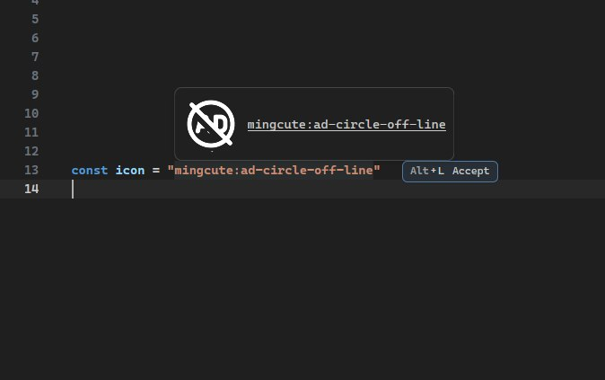

# Iconify IntelliSense for Zed

Zed extension inspired by the VS Code extension ["Iconify IntelliSense"](https://marketplace.visualstudio.com/items?itemName=antfu.iconify).

## How It Works
- On first initialization, the extension installs `@iconify/json` using Zed's NPM integration.
- When you type a prefix like `mingcute:` the LSP loads `@iconify/json/json/mingcute.json` and offers fuzzy-matched icon names.

## Features
- Icon name completions for `pack:` prefixes, with fuzzy matching on icon names only
- Completions available in common web languages (JS/TS/HTML/CSS/Markdown/Vue/Svelte/Astro)
- Hover previews for Iconify icons
- Optional snippets and quick inserts

## Status
Icon name completions and preview on hover are implemented via a lightweight LSP.

## Development
- Open Zed
- Use `Extensions: Install Dev Extension` and select this folder
- Ensure the Rust target is installed: `rustup target add wasm32-wasip1`

## TODO
- Define extension settings and defaults
